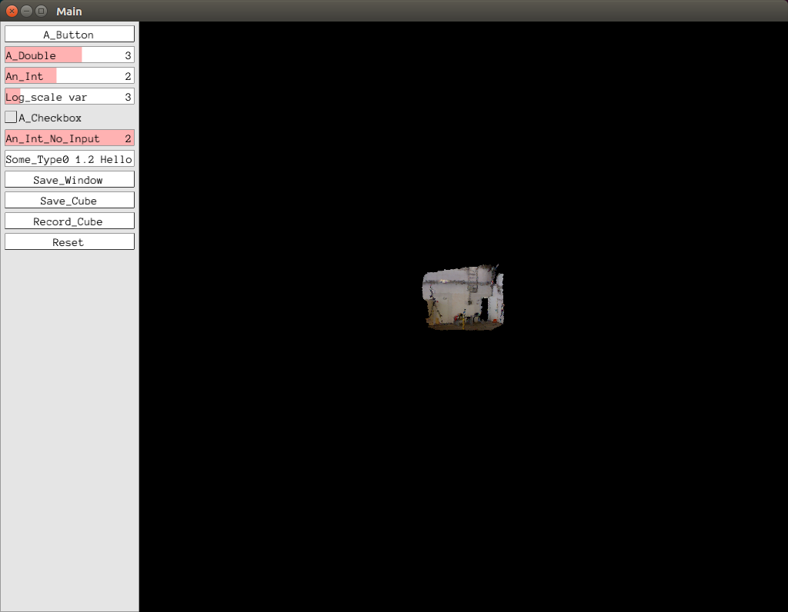

# PangoCloud
> Jacky Liu
> 2017 03 12

A minimal example show RGB-D image with Pangolin and OpenCV

Keyword:
1. Point cloud
2. Pangolin
3. OpenCV


## 1. What do I need to build it?
  - Ubuntu 16.04
  - CMake
  - OpenGL
  - Eigen
  - [Pangolin](https://github.com/stevenlovegrove/Pangolin)

## 2. Build PangoCloud

Under PangoCloud root directory, type the following commands.
```bash
mkdir build
cd build
cmake ..
make
```
If the compilation is successed, you should see a executable file 'PangoCloud' under build folder.

Execute it by
```bash
./PangoCloud
```

### Result screenshot
  - Scroll mouse: zoom
  - Left mouse drag: translation
  - Right mouse drag: rotation

